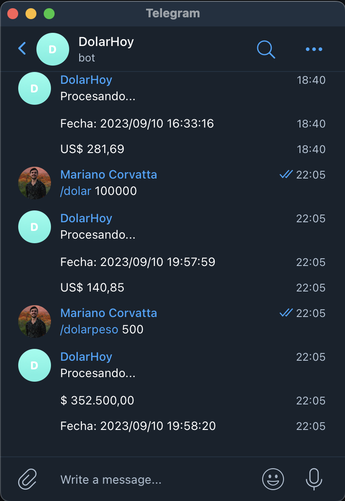

# Dolar Contact Bot

This is a Telegram bot developed in Node.js that provides information about currency exchange rates, including the US dollar and euro in Argentina. (Not official exchange rates)

## Features

The bot offers the following features:

- Convert an amount of Argentine pesos to US dollars.
- Convert an amount of US dollars to Argentine pesos.
- Convert an amount of Argentine pesos to euros.
- Convert an amount of euros to Argentine pesos.

## Requirements

To run this bot, you need to have Node.js installed on your machine. Additionally, you need a Telegram API key that you should configure in a `.env` file.

## Installation

1. Clone this repository on your machine:

   ```shell
   git clone https://github.com/yourusername/dolar-contact-bot.git
   ```
2. Navigate to the project directory:

   ```shell
   cd dolar-contact-bot
   ```
3. Install the dependencies:

   ```shell
   npm install
   ```
4. Create a `.env` file and add your Telegram API key:

   ```
    TELEGRAM_API_KEY=your_telegram_api_key
   ```
5. Run the application:

   ```shell
   npm start
   ```

## Usage

Once the bot is up and running, you can interact with it on Telegram by sending commands like "/dollar", "/dolarpeso", "/euro", and "/europeso," followed by the amount you want to convert.



## Example

To convert 1000 Argentine pesos to US dollars, you can send the command:

 ```shell
 /dollar 1000
 ```

The bot will respond with the equivalent amount in US dollars and the current date.

